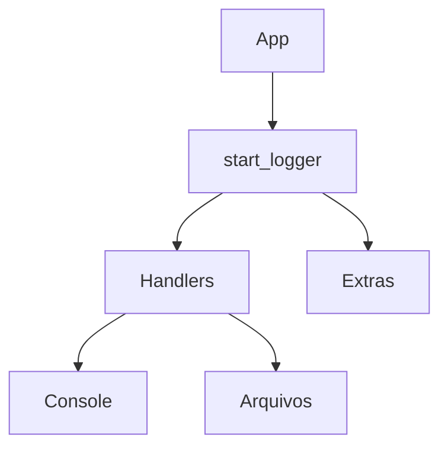

# Logger


Biblioteca em Python para logging estruturado com métricas, profiling e barra de progresso.

## Sumário
- [Visão Geral](#visão-geral)
- [Instalação](#instalação)
- [Uso Básico](#uso-básico)
- [Documentação](#documentação)
- [Contribuição](#contribuição)

## Visão Geral
O pacote oferece uma forma simples de iniciar um `logging.Logger` enriquecido com:
- Formatação colorida com emojis
- Logs de arquivo e console separados
- Monitoração de CPU/Memória e detecção de vazamentos
- Funções utilitárias como `timer`, `progress` e captura de prints

### Diagrama Resumido


## Instalação
```bash
pip install -e .[dev]
```
Ou utilize `requirements.lock` para reproduzir o ambiente.

## Uso Básico
```python
from logger import start_logger

logger = start_logger("Demo")
logger.info("Processo iniciado")
```

## Documentação
Guias completos estão em [docs/](docs/). Para gerar a versão HTML local:
```bash
make -C docs html
```

## Contribuição
Siga o fluxo descrito em [docs/developer_guide.md](docs/developer_guide.md).
