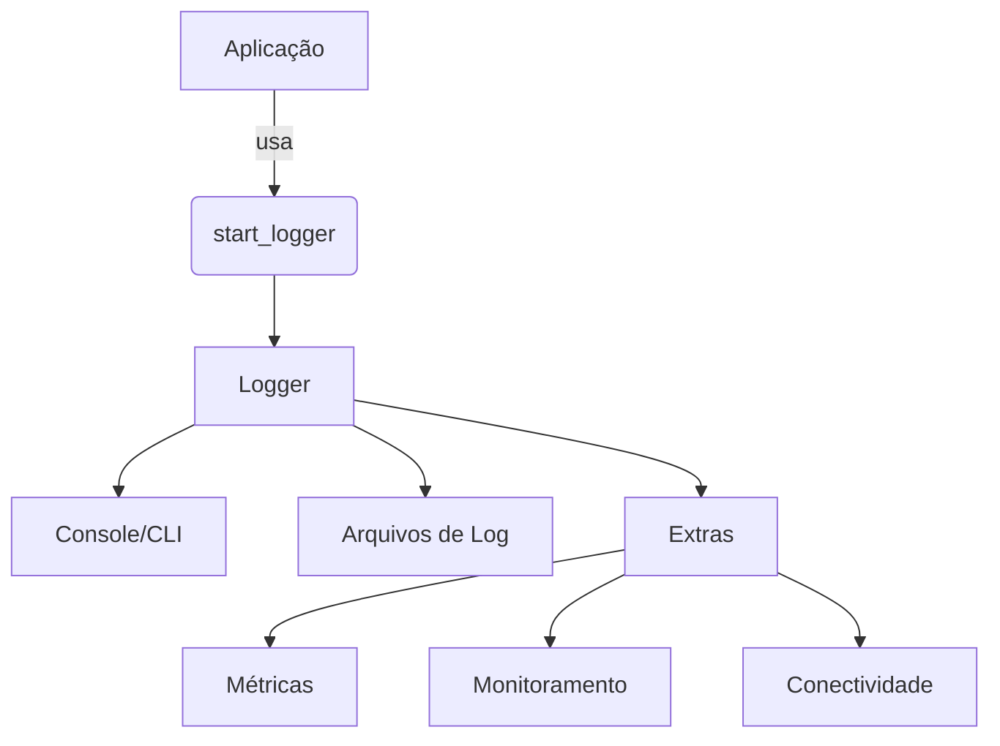
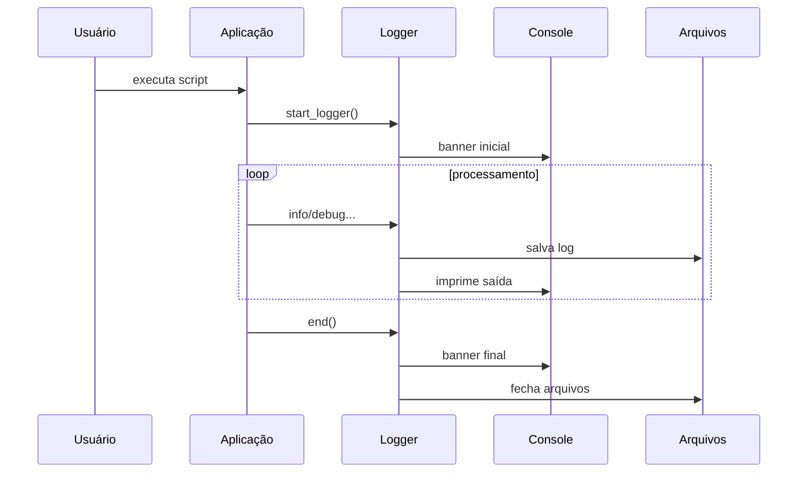

# Visão de Arquitetura

```mermaid
graph TD
    App[Aplicação] -->|usa| Start(start_logger)
    Start --> Logger
    Logger --> Console[Console/CLI]
    Logger --> Files[Arquivos de Log]
    Logger --> Extras
    Extras --> Metrics[Métricas]
    Extras --> Monitoring[Monitoramento]
    Extras --> Network[Conectividade]
```

```mermaid
sequenceDiagram
    participant U as Usuário
    participant A as Aplicação
    participant L as Logger
    participant C as Console
    participant F as Arquivos

    U->>A: executa script
    A->>L: start_logger()
    L->>C: banner inicial
    loop processamento
        A->>L: info/debug...
        L->>F: salva log
        L->>C: imprime saída
    end
    A->>L: end()
    L->>C: banner final
    L->>F: fecha arquivos
```
