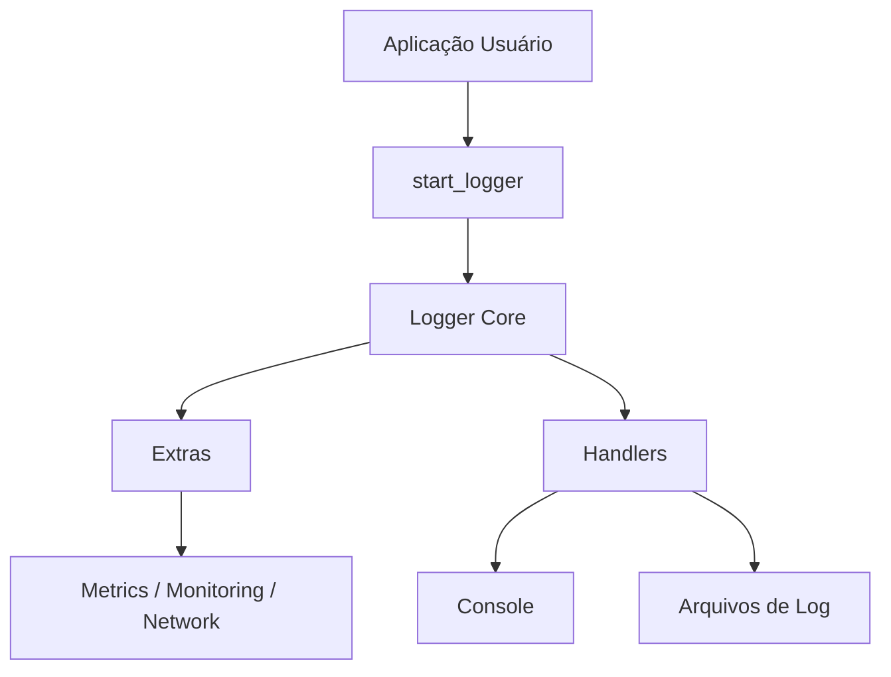
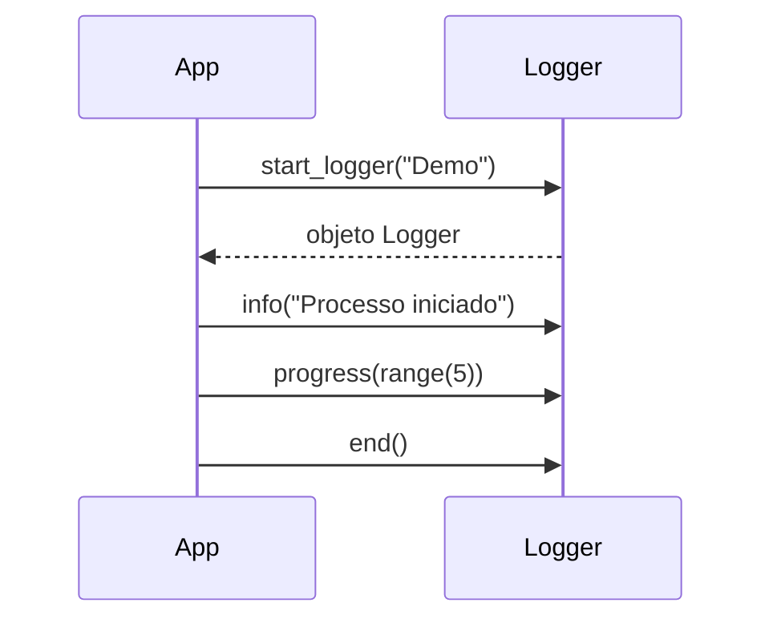

# Visão de Arquitetura

O diagrama acima mostra o fluxo principal: a aplicação inicializa o logger com `start_logger`, que configura o núcleo e adiciona funcionalidades extras. As mensagens são enviadas para o console e para arquivos de log.

Nesta sequência, a aplicação cria o logger, registra mensagens e encerra a execução.
